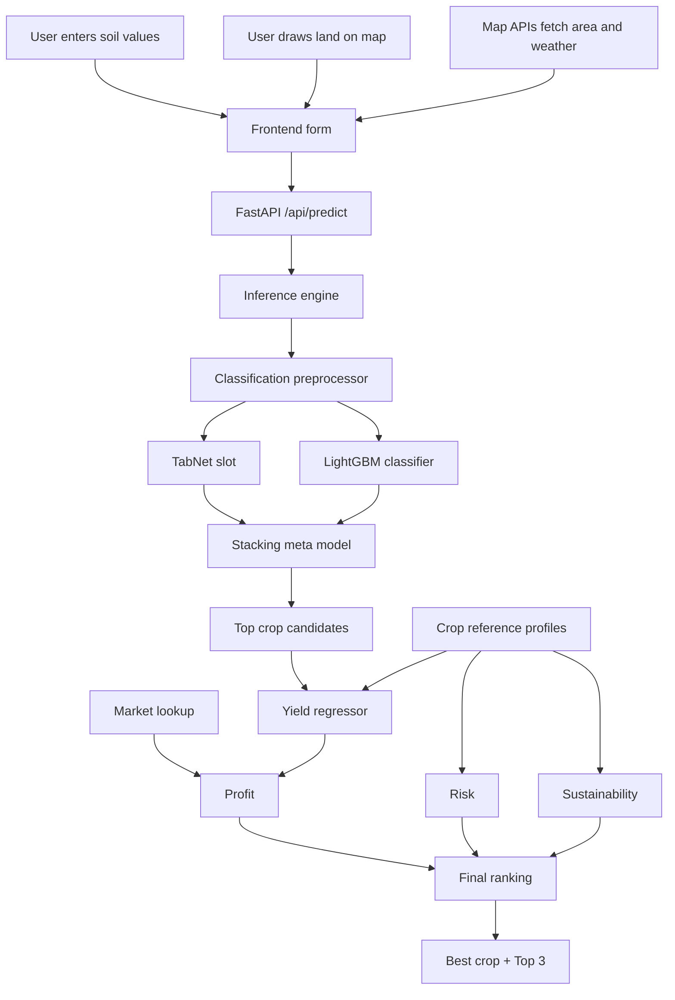
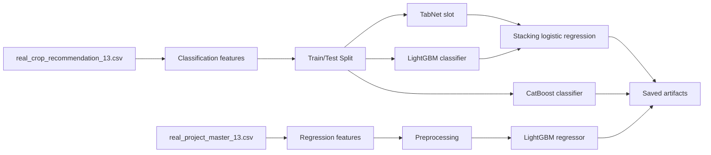
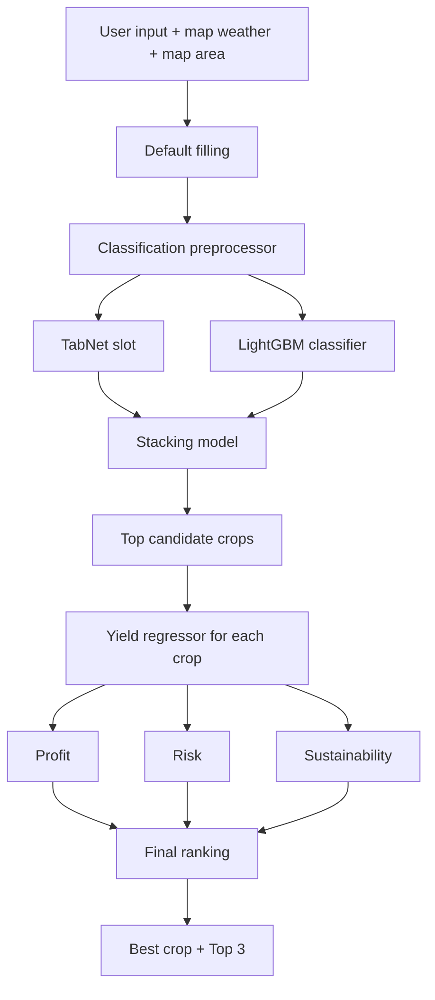

# Crop Intelligence Platform

## Full Project Documentation

Prepared for viva, report explanation, and PPT preparation.

## 1. Introduction

The Crop Intelligence Platform is a complete AI and machine learning based agricultural decision support system. It helps a user choose the most suitable crop for a piece of land by combining soil features, location-based weather, historical crop production, crop-specific ideal conditions, and market price information.

This is not only a crop classification project. It also predicts yield, estimates profit, measures climate risk, computes a sustainability score, and ranks the top crop options.

The final system supports:

- crop recommendation
- yield prediction
- model comparison
- stacking ensemble
- map-based area selection
- weather-assisted input filling
- top-3 crop ranking

## 2. Problem Statement

Farmers and agricultural users often need answers to multiple questions at once:

- Which crop is suitable for my soil and climate?
- What yield can I expect?
- What profit can I earn from that crop?
- How risky is the crop for current conditions?
- Which are the next best alternatives?

A normal ML model usually predicts just one crop label. This project improves that by integrating agronomic suitability, yield, profitability, and risk into one deployable platform.

## 3. Final Project Scope

The final version uses a real-data 13-crop pipeline. The crops are:

- Apple
- Banana
- Blackgram
- Coconut
- Coffee
- Grapes
- Jute
- Lentil
- Maize
- Mango
- Orange
- Papaya
- Rice

## 4. Why The Project Was Redesigned

An earlier synthetic-style dataset was not reliable for strong real-world classification. It had too many classes, weak separability, and poor exact prediction quality. So the final system was redesigned around a real overlapping multi-dataset architecture.

This improved:

- realism
- explainability
- model performance
- viva defensibility

## 5. Final Datasets Used

### 5.1 `real_crop_recommendation_13.csv`

Purpose:
- train the crop recommendation classifier

Main columns:
- `crop`
- `nitrogen`
- `phosphorous`
- `potassium`
- `temperature_c`
- `humidity`
- `ph`
- `rainfall_mm`

Rows:
- 1300

### 5.2 `real_crop_production_13.csv`

Purpose:
- provide historical crop production support

Main columns:
- `state_name`
- `district_name`
- `crop_year`
- `season`
- `crop`
- `area`
- `production`
- derived `yield`

### 5.3 `real_crop_reference_profiles_13.csv`

Purpose:
- store ideal crop requirements

Main columns:
- ideal nitrogen
- ideal phosphorous
- ideal potassium
- ideal temperature
- ideal humidity
- ideal pH
- ideal rainfall

### 5.4 `real_market_lookup_13.csv`

Purpose:
- provide price per ton for each crop

### 5.5 `real_project_master_13.csv`

Purpose:
- final regression dataset for yield prediction

Rows:
- 46,550

This dataset combines historical production rows with crop ideal profiles and pricing support.

## 6. Why Multiple Datasets Were Needed

One dataset alone did not contain all the information needed for:

- suitability classification
- yield regression
- crop ideal conditions
- pricing

So the project uses a split-pipeline design:

- one dataset for classification
- one dataset for yield regression
- one dataset for crop profiles
- one dataset for market price lookup

This is a stronger architecture than forcing all tasks into one weak CSV.

## 7. System Architecture

## 8. File Architecture

### ML layer

- `backend/ml/config.py`
- `backend/ml/models.py`
- `backend/ml/training.py`
- `backend/ml/inference.py`

### API layer

- `backend/app/main.py`
- `backend/app/api/routes.py`
- `backend/app/services/predictor.py`
- `backend/app/schemas.py`

### Frontend layer

- `backend/app/static/index.html`
- `backend/app/static/styles.css`
- `backend/app/static/app.js`

### Runtime artifacts

- `models/*.joblib`
- `models/runtime_metadata.json`
- `reports/training_metrics.json`

## 9. Model Inputs And Targets

### Classification features

Defined in `backend/ml/config.py`:

- `nitrogen`
- `phosphorous`
- `potassium`
- `temperature_c`
- `humidity`
- `ph`
- `rainfall_mm`

Target:
- `crop`

### Regression numeric features

- `crop_year`
- `area`
- `ideal_nitrogen`
- `ideal_phosphorous`
- `ideal_potassium`
- `ideal_temperature_c`
- `ideal_humidity`
- `ideal_ph`
- `ideal_rainfall_mm`
- `price_per_ton`

### Regression categorical features

- `crop`
- `state_name`
- `district_name`
- `season`

Target:
- `yield`

## 10. Models Used

### TabNet classifier slot

Role:
- crop classification

Why used:
- designed for tabular structured data
- capable of learning nonlinear feature interactions

Important implementation note:
- if `pytorch-tabnet` is not available locally, the project uses a tree-based fallback for that slot

### LightGBM classifier

Role:
- main crop classifier

Why used:
- excellent performance on tabular data
- fast and strong nonlinear learning

### CatBoost classifier

Role:
- benchmark comparison model

Why used:
- strong tabular baseline for comparison

### Logistic Regression stacking model

Role:
- combine base model probabilities

Why used:
- simple and stable meta-model
- suitable for probability stacking

### LightGBM regressor

Role:
- yield prediction

Why used:
- strong regression performance on structured mixed features

## 11. Training Pipeline Step By Step

Training is implemented in `backend/ml/training.py`.

### Step 1: Load all required datasets

The pipeline loads:

- recommendation dataset
- master regression dataset
- crop profile dataset
- market lookup dataset
- production dataset

### Step 2: Prepare crop labels

`LabelEncoder` converts crop names into numeric labels for classification.

### Step 3: Build classification matrix

The classifier uses only the agronomy suitability features from `real_crop_recommendation_13.csv`.

### Step 4: Train-test split

For classification:

- 80% training
- 20% testing
- stratified by crop

### Step 5: Classification preprocessing

The classification preprocessor uses:

- `ColumnTransformer`
- `SimpleImputer(strategy="median")`

Why:
- handle missing numeric values
- create a clean model-ready matrix

### Step 6: Internal split for stacking

The classification training data is split again into:

- base-model training set
- meta-model training set

This allows the stacking model to learn from base-model probabilities.

### Step 7: Train base classifiers for stacking

Base models trained:

- TabNet slot model
- LightGBM classifier

### Step 8: Train stacking model

The Logistic Regression meta-model is trained on:

- TabNet probabilities
- LightGBM probabilities

### Step 9: Train final classification models

The pipeline then trains final versions of:

- TabNet slot
- LightGBM classifier
- CatBoost classifier

### Step 10: Prepare regression matrix

The yield model uses `real_project_master_13.csv`.

The regression preprocessor includes:

- numeric median imputation
- categorical most-frequent imputation
- one-hot encoding

### Step 11: Train yield regressor

The LightGBM Regressor is trained on processed regression data.

### Step 12: Evaluate models

Classification metrics:

- Accuracy
- Weighted F1
- Top-3 Accuracy

Regression metrics:

- RMSE
- R²

### Step 13: Save all artifacts

Saved into `models/`:

- `tabnet_model.joblib`
- `lgbm_model.joblib`
- `catboost_model.joblib`
- `yield_model.joblib`
- `stacking_model.joblib`
- `classification_preprocessor.joblib`
- `regression_preprocessor.joblib`
- `crop_label_encoder.joblib`
- `runtime_metadata.json`

## 12. Training Diagram

## 13. Inference Pipeline Step By Step

Inference is implemented in `backend/ml/inference.py`.

### Step 1: Load model bundle

The inference engine loads:

- preprocessors
- label encoder
- trained classifiers
- trained yield model
- runtime metadata

### Step 2: Fill defaults

If some values are missing, the engine fills them from saved dataset defaults such as:

- season
- state
- district
- crop year
- price per ton

### Step 3: Build classification row

The engine constructs a one-row dataframe using the 7 classification features.

### Step 4: Predict crop probabilities

The engine generates:

- TabNet slot probabilities
- LightGBM probabilities
- stacking probabilities

### Step 5: Select candidate crops

The top internal ranking pool is taken from the highest stacked probabilities.

### Step 6: Predict yield for each candidate crop

For each candidate crop, a new regression row is built using:

- crop name
- location defaults or input values
- area
- crop ideal profile values
- price per ton

Then the LightGBM Regressor predicts expected yield.

### Step 7: Compute profit

Formula:

`profit = predicted_yield × area × price_per_ton`

### Step 8: Compute climate risk

The system compares:

- current temperature vs ideal temperature
- current rainfall vs ideal rainfall

Then normalizes the mismatch to a 0-1 score.

### Step 9: Compute sustainability

The system compares the user input against crop ideal values for:

- nitrogen
- phosphorous
- potassium
- pH
- humidity

Smaller mismatch gives better sustainability.

### Step 10: Final ranking

The project uses:

`final_score = 0.4 × yield_score + 0.3 × profit_score + 0.2 × risk_score + 0.1 × sustainability_score`

The output includes:

- best crop
- top 3 crops
- predicted yield
- profit
- risk
- sustainability

## 14. Inference Diagram

## 15. Frontend And API Workflow

Frontend:

- `index.html`
- `styles.css`
- `app.js`

API:

- `GET /api/health`
- `GET /api/metadata`
- `POST /api/predict`
- `POST /api/train`

User flow:

1. user opens the app
2. metadata loads
3. user enters soil values
4. user draws land on the map
5. frontend auto-fills area and weather
6. user clicks `Predict Best Crop`
7. frontend sends JSON to `/api/predict`
8. backend runs inference
9. frontend shows best crop and top 3

## 16. Why Map Integration Was Added

Map integration improves the project by:

- reducing manual input
- estimating land area automatically
- capturing location coordinates
- enabling weather autofill

This makes the platform more practical than a plain form-only ML demo.

## 17. Rainfall Logic

Rainfall was an important design challenge.

Daily rainfall such as `0.2 mm` is not always a good agronomic feature for crop suitability. So the project now uses climate-aware rainfall logic in the frontend:

- live temperature from API
- live humidity from API
- recent rainfall from weather history
- climate-aware rainfall value for the prediction field

This is better than using only current rain because crop suitability depends more on accumulated or climate-style rainfall.

## 18. Market, Profit, Risk, Sustainability

### Profit

`profit = predicted_yield × area × price_per_ton`

### Risk

Based on temperature and rainfall mismatch against crop ideal values.

### Sustainability

Based on closeness of user nutrient and pH values to crop ideal profile values.

These make the project a decision support system rather than only a classifier.

## 19. Final Measured Results

From `reports/training_metrics.json`:

- TabNet slot accuracy: `0.9962`
- LightGBM accuracy: `0.9962`
- CatBoost accuracy: `0.9885`
- Stacking accuracy: `1.0000`
- Top-3 accuracy: `1.0000`
- Yield RMSE: `515.3577`
- Yield R²: `0.8581`

Interpretation:

- the classification task is extremely strong on the final 13-crop dataset
- the regression task is also strong with good explanatory power

## 20. Strengths Of The Project

- real-data pipeline
- multiple integrated datasets
- ensemble learning
- yield + crop + profit integration
- map support
- weather-assisted input
- top-3 ranking
- deployment-ready structure

## 21. Limitations

- final scope covers 13 crops only
- rainfall semantics need careful interpretation
- market price is lookup-based, not full live mandi integration
- SHAP explanation is optional and may be skipped if not installed
- TabNet may run as a fallback slot if its dependency is unavailable

## 22. Why This Project Is Better Than A Basic Crop Recommendation Model

A basic crop recommendation project usually predicts one crop from NPK values only. This project improves that by adding:

- multi-model learning
- stacking ensemble
- yield prediction
- profit estimation
- risk scoring
- sustainability scoring
- map-based area capture
- top-3 ranking

So this is a full crop intelligence platform, not a simple classifier.

## 23. Viva Questions And Strong Answers

### Why did you use multiple datasets?

Because no single dataset contained recommendation features, production history, crop ideal profiles, and market prices together. So a multi-dataset pipeline was necessary.

### Why did you use stacking?

Stacking combines the strengths of base classifiers. In this project, TabNet slot and LightGBM probabilities are combined using logistic regression for a stronger final crop prediction.

### Why LightGBM for regression?

LightGBM performs very well on structured mixed-feature tabular regression and is efficient on large datasets.

### Why CatBoost if it is not used in stacking?

CatBoost is used as a benchmark model for comparison to validate the final classification choice.

### Why add map integration?

It improves realism by automatically capturing area and location-based weather rather than forcing the user to type everything manually.

### Why is rainfall important?

Rainfall affects crop suitability and climate risk, so it is an important agricultural input feature.

### Why not use only today’s rainfall?

Today’s rainfall is too short-term and noisy. Crop suitability is better represented by climate-style or accumulated rainfall values.

## 24. Conclusion

The Crop Intelligence Platform is a real-data AI system that combines crop recommendation, yield prediction, profit estimation, risk evaluation, sustainability scoring, and map-based input capture into one deployable agricultural decision support platform.

It demonstrates:

- data integration
- model integration
- ensemble learning
- business logic integration
- user-facing deployment

## 25. Key Viva Numbers To Remember

- crops covered: `13`
- recommendation rows: `1300`
- production/master rows: `46550`
- classification features: `7`
- stacking accuracy: `1.0000`
- LightGBM accuracy: `0.9962`
- CatBoost accuracy: `0.9885`
- yield R²: `0.8581`
- final ranking weights:
  - `0.4 yield`
  - `0.3 profit`
  - `0.2 risk`
  - `0.1 sustainability`
